# Manual de Usuario — ERP Corporativo E&I

> **Versión:** 2.0  
> **Sistema:** ERP Estrategia e Innovación  
> **Última actualización:** Junio 2026

---

## 1. Introducción

### 1.1 ¿Qué es el ERP Corporativo?

El ERP (Enterprise Resource Planning) de Estrategia e Innovación es una plataforma web corporativa que centraliza la gestión de:

- **Recursos Humanos** — Expedientes de empleados, control de asistencia, evaluaciones de desempeño, capacitación, días festivos, recordatorios automáticos y jerarquía organizacional.
- **Logística y Aduanas** — Clientes, matriz de seguimiento de operaciones internacionales, matriz de apoyo operativo y reportes ejecutivos.
- **Legal** — Gestión de consultas jurídicas, categorías legales, programas y herramientas de digitalización de documentos para VUCEM.
- **Sistemas IT** — Tickets de soporte técnico, inventario de activos, programación de mantenimiento de equipos y credenciales.
- **Administración** — Clientes y perfiles detallados de comercio exterior.
- **Proyectos y Actividades** — Planificación, asignación y seguimiento de proyectos empresariales con tablero de actividades.

### 1.2 ¿Quiénes usan el sistema?

| Área | Usuarios típicos |
|---|---|
| **Recursos Humanos** | Dirección, administración RH, coordinadores, supervisores |
| **Logística** | Ejecutivos de operaciones, gerentes, tramitadores aduanales |
| **Legal** | Abogados, consultores jurídicos |
| **Sistemas IT** | Administradores de sistemas, help desk, soporte técnico |
| **Administración** | Directivos, administradores |
| **Todos los colaboradores** | Creación de tickets, consulta de perfil, actividades, proyectos, evaluación de desempeño, capacitación |

### 1.3 Requisitos Técnicos

- Navegador web moderno (Chrome, Edge, Firefox, Safari — última versión)
- Conexión a internet
- Resolución de pantalla recomendada: 1280×768 o superior
- Cuenta de correo electrónico corporativo

---

## 2. Acceso al Sistema

### 2.1 Iniciar Sesión

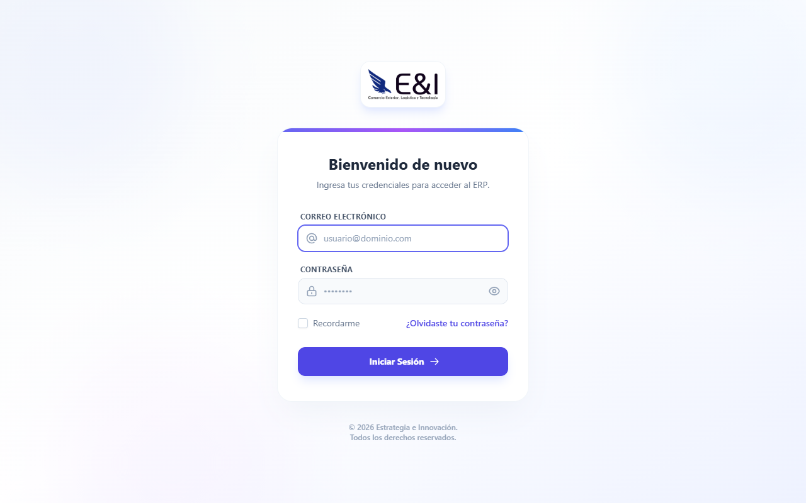

📋 **Qué necesitas:** Credenciales proporcionadas por RH o Sistemas.

1. Abra su navegador y vaya a la dirección del ERP (proporcionada por su administrador).
2. En la pantalla de bienvenida, haga clic en el botón **"Iniciar Sesión"**.
3. Ingrese su **correo electrónico corporativo** en el campo "Correo Electrónico".
4. Escriba su **contraseña** en el campo "Contraseña".
   - Puede hacer clic en el **icono del ojo** 👁️ para revelar/ocultar la contraseña.
5. Si lo desea, active la casilla **"Recordarme"** para no tener que iniciar sesión cada vez.
6. Presione el botón **"Iniciar Sesión"**.

✅ **Resultado:** Será redirigido al Portal Corporativo.

> ⚠️ **Nota:** Si es la primera vez que accede, su cuenta debe ser aprobada por un administrador. Mientras tanto, verá un mensaje indicando que su cuenta está pendiente.

### 2.2 Registro de Nueva Cuenta

📋 **Qué necesitas:** Correo electrónico corporativo.

1. En la pantalla de inicio, haga clic en el enlace **"Registrarse"**.
2. Complete los campos obligatorios:
   - **Nombre completo**
   - **Correo electrónico corporativo**
   - **Contraseña** (mínimo 8 caracteres)
   - **Confirmar contraseña**
3. Haga clic en **"Crear Cuenta"**.

✅ **Resultado:** Su cuenta queda en estado **"Pendiente"**. Recibirá un correo cuando un administrador la apruebe.

🔁 **Siguiente paso:** Espere la aprobación (usualmente 24 hrs hábiles). Si pasa más tiempo, contacte a Sistemas.

### 2.3 Recuperar Contraseña

📋 **Qué necesitas:** Acceso a su correo corporativo.

1. En la pantalla de inicio, haga clic en **"¿Olvidaste tu contraseña?"**.
2. Ingrese su **correo electrónico**.
3. Haga clic en **"Enviar enlace"**.
4. Revise su bandeja de correo. Recibirá un mensaje con un enlace para restablecer la contraseña.
5. Siga el enlace, ingrese su nueva contraseña y confírmela.
6. Haga clic en **"Restablecer contraseña"**.

✅ **Resultado:** Ya puede iniciar sesión con su nueva contraseña.

### 2.4 Cerrar Sesión

1. Haga clic en su **avatar (iniciales)** en la esquina superior derecha.
2. En el menú desplegable, seleccione **"Cerrar Sesión"** (icono rojo).

---

## 3. Portal Corporativo (Inicio)

### 3.1 Pantalla Principal

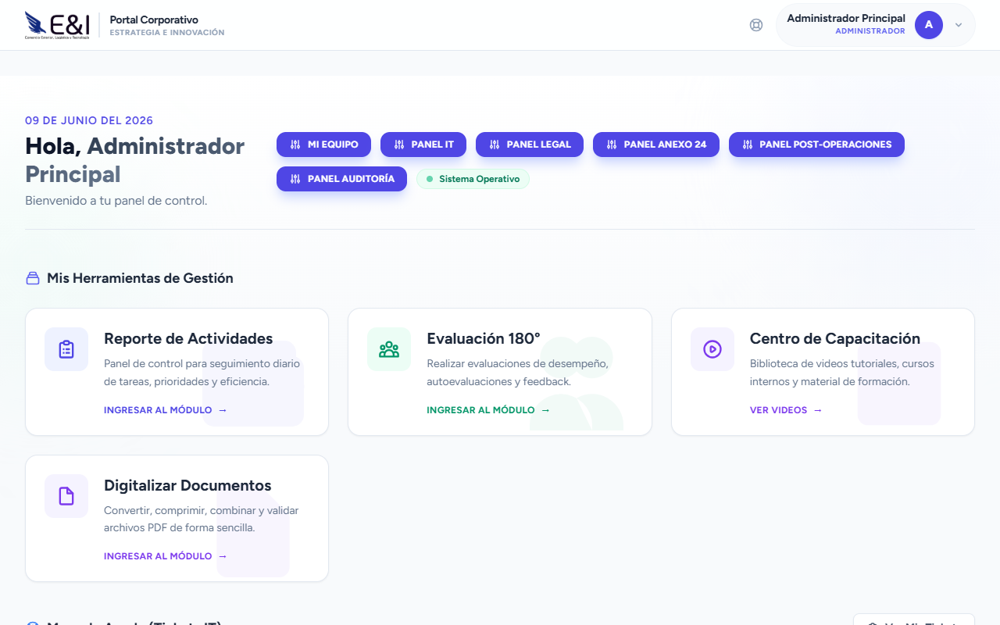

Al iniciar sesión verá el **Portal Corporativo**. La pantalla se compone de:

**Barra de navegación superior:**
- **Logo de E&I** — Al hacer clic, vuelve al inicio del módulo actual.
- **Título contextual** — Cambia según el módulo donde se encuentre:
  - "Portal Corporativo" (inicio general)
  - "Recursos Humanos" (módulo RH)
  - "Logística y Aduanas" (módulo Logística)
- **Icono de herramientas** ⚙️ — Acceso directo para reportar un problema IT.
- **Avatar de usuario** — Menú desplegable con: nombre, rol, "Mi Perfil", "Inicio", "Cerrar Sesión".

**Cuerpo:**
- **Tarjetas de acceso** — Accesos directos a los módulos disponibles según su rol y permisos.
- Solo verá las tarjetas de los módulos a los que tiene acceso.

### 3.2 Navegación Inteligente

El sistema detecta automáticamente en qué módulo navega:

| Si está en... | El logo lo lleva a... | El título muestra... |
|---|---|---|
| Portal general | Portal Corporativo | Portal Corporativo |
| Módulo RH | Dashboard RH | Recursos Humanos |
| Módulo Logística | Dashboard Logística | Logística y Aduanas |

### 3.3 Reportar un Problema IT

Desde cualquier pantalla:
1. Haga clic en el **icono de herramientas** ⚙️ en la barra superior derecha.
2. Será redirigido al formulario de creación de ticket.

*(El procedimiento detallado está en la sección 7.2 Tickets)*

---

## 4. Módulo de Recursos Humanos

> **Acceso:** Usuarios con puesto de dirección, administración RH o TI.  
> **URL:** `/recursos-humanos`

### 4.1 Dashboard RH

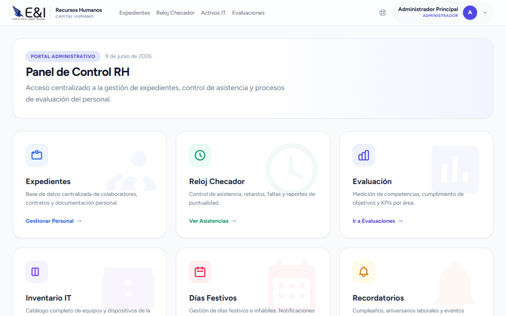

Al entrar al módulo RH verá un panel con tarjetas de acceso:

| Tarjeta | Descripción |
|---|---|
| **Expedientes** | Gestión de colaboradores, contratos y documentos personales |
| **Reloj Checador** | Control de asistencia: retardos, faltas y reportes |
| **Evaluación** | Evaluaciones de desempeño por periodo |
| **Inventario IT** | Consulta de activos informáticos asignados a empleados |
| **Capacitación** | Centro de capacitación con videos y materiales |
| **Días Festivos** | Calendario de días festivos e inhábiles |
| **Recordatorios** | Alertas automáticas (cumpleaños, aniversarios, vencimientos) |
| **Jerarquía** | Organigrama y asignación de supervisores |

---

### 4.2 Expedientes — Gestión de Colaboradores

#### 4.2.1 Ver Lista de Empleados

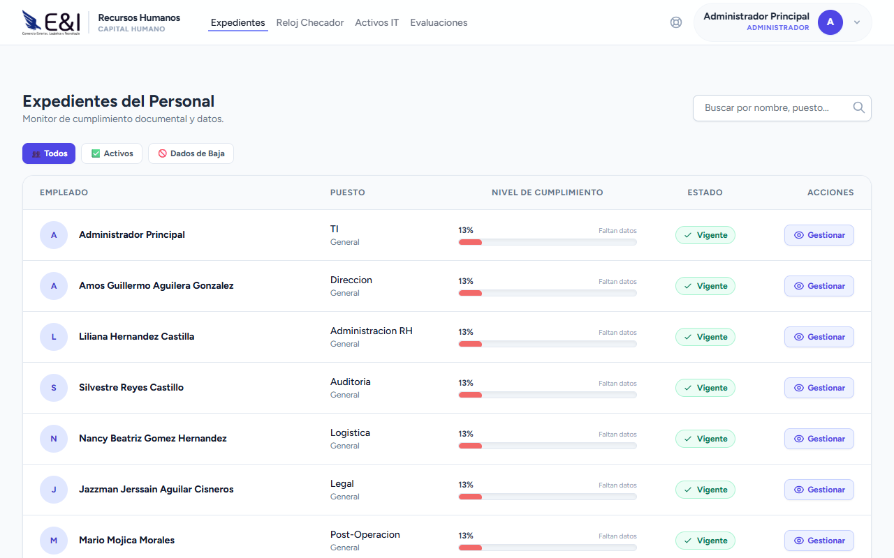

📋 **Prerrequisitos:** Acceso al módulo RH.

1. En el Dashboard RH, haga clic en la tarjeta **"Expedientes"**.
2. Aparece una tabla con todos los empleados activos.
3. Use el **buscador** para filtrar por nombre, ID de empleado o área.
4. Cada fila muestra: foto, nombre, ID, área, posición, supervisor, estatus del expediente.

#### 4.2.2 Ver Detalle de un Expediente

1. En la lista de expedientes, haga clic en el **nombre** del empleado que desea consultar.
2. La pantalla de detalle muestra:

**Sección "Datos Personales":**
- Nombre completo, correo, teléfono, dirección, fecha de nacimiento.
- RFC, CURP, NSS.
- Contacto de emergencia.

**Sección "Datos Laborales":**
- Área, posición, ID de empleado.
- Supervisor asignado.
- Fechas: ingreso, inicio/fin de contrato, tipo de contrato.
- Indicador **% de expediente completo** (barra de progreso).

**Sección "Alerta de Expediente"**
El sistema evalúa automáticamente el estado del expediente y muestra un color:

| Color | Significado |
|---|---|
| 🟢 **Verde (Vigente)** | Todos los documentos obligatorios están en regla |
| 🟡 **Amarillo (Por Vencer)** | Algún documento está próximo a vencer |
| 🟠 **Naranja (Incompleto)** | Faltan documentos obligatorios |
| 🔴 **Rojo (Vencido)** | Algún documento ya venció |

**Sección "Documentos":**
- Lista de documentos del empleado (contrato, identificaciones, comprobantes).
- Cada documento muestra: nombre, categoría, fecha de vencimiento, botón de descarga.

#### 4.2.3 Subir un Documento al Expediente

📋 **Prerrequisitos:** Ser administrador RH o dirección.

1. Dentro del expediente del empleado, vaya a la sección **"Documentos"**.
2. Haga clic en **"Subir Documento"**.
3. En el formulario modal:
   - **Tipo de documento:** Seleccione de la lista (Contrato, Identificación, Comprobante de estudios, etc.).
   - **Nombre:** Opcional, si no se llena se usa el nombre del archivo.
   - **Archivo:** Haga clic en "Seleccionar archivo" y elija el PDF o imagen.
   - **Fecha de vencimiento:** Si el documento tiene vigencia, seleccione la fecha.
4. Haga clic en **"Subir"**.

✅ **Resultado:** El documento aparece en la lista y el porcentaje del expediente se actualiza.

#### 4.2.4 Dar de Alta un Empleado

📋 **Prerrequisitos:** Ser administrador RH o dirección.

1. En la lista de expedientes, haga clic en **"Alta de Empleado"**.
2. Complete los campos obligatorios (marcados con \*):
   - **Nombre completo**
   - **Correo electrónico** (se usará para crear el usuario)
   - **ID de empleado** (clave interna)
   - **Área** (departamento al que pertenece)
   - **Subdepartamento**
   - **Posición** (cargo)
   - **Fecha de ingreso**
   - **Tipo de contrato** (Indeterminado, Temporal, Prácticas, etc.)
3. Opcionalmente, capture datos adicionales: teléfono, dirección, RFC, CURP, NSS, contacto de emergencia.
4. Haga clic en **"Guardar"**.

✅ **Resultado:** Se crea el empleado y automáticamente se genera un **usuario** asociado en el sistema. El empleado recibirá un correo para activar su cuenta.

#### 4.2.5 Dar de Baja un Empleado

📋 **Prerrequisitos:** Ser administrador RH o dirección.

1. Busque al empleado en la lista y abra su expediente.
2. Haga clic en **"Dar de Baja"**.
3. En el modal:
   - **Fecha de baja:** Seleccione la fecha efectiva.
   - **Motivo:** Seleccione de la lista (renuncia, término de contrato, despido, jubilación, etc.).
   - **Observaciones:** Detalle adicional (opcional).
4. Haga clic en **"Confirmar Baja"**.

✅ **Resultado:** El empleado se mueve a la tabla de `empleados_baja` y su usuario queda desactivado.

---

### 4.3 Reloj Checador — Control de Asistencia

#### 4.3.1 Consultar Asistencias

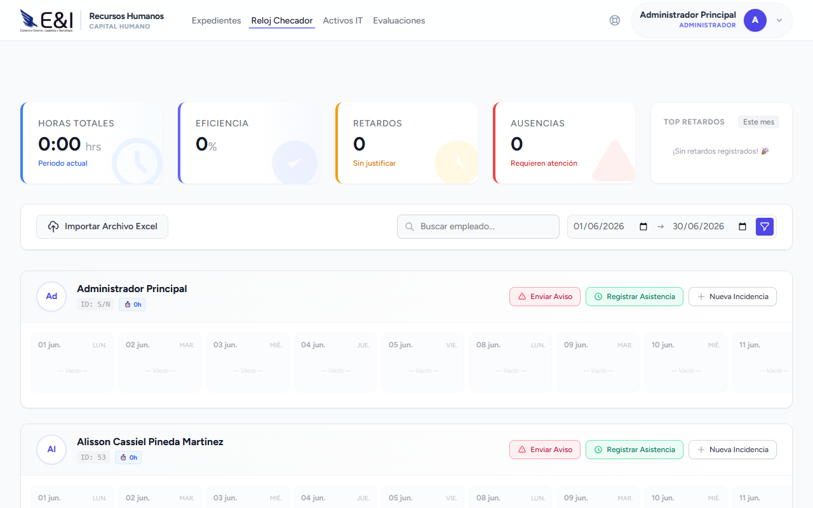

📋 **Prerrequisitos:** Acceso al módulo RH.

1. En el Dashboard RH, haga clic en **"Reloj Checador"**.
2. Aparece una tabla con los registros de asistencia.
3. Use los filtros para refinar la búsqueda:
   - **Fecha:** Seleccione un rango (desde / hasta).
   - **Empleado:** Busque por nombre o código de empleado.
   - **Tipo:** Puntual, Retardo, Falta (opcional).

**Interpretación de la tabla:**
- Cada fila representa un día de un empleado.
- Columnas: empleado, fecha, hora de entrada, hora de salida, horas trabajadas, tipo.

**Indicadores visuales:**
| Indicador | Significado |
|---|---|
| ✅ **Verde** | Asistencia puntual (entrada antes de las 8:40 AM) |
| ⚠️ **Amarillo** | Retardo justificado |
| ❌ **Rojo** | Retardo injustificado o falta |
| ⬜ **Gris** | Día no laborado (descanso semanal o festivo) |

#### 4.3.2 Justificar una Falta o Retardo (Paso a Paso)

📋 **Prerrequisitos:** Acceso al módulo RH. Para justificar, se requiere ser administrador RH, dirección o TI.

1. En la tabla de asistencias, localice el registro del empleado y la fecha que desea justificar.
2. Haga clic en el **icono de lápiz** ✏️ (o en la fila si tiene un modal de edición).

   > Si no ve el icono, puede hacer clic directamente en la fila del registro.

3. Se abre un **modal de edición** con los siguientes campos:
   - **Empleado:** (solo lectura) — nombre del empleado.
   - **Fecha:** (solo lectura) — fecha del registro.
   - **Hora de entrada / salida:** (solo lectura) — horas registradas por el reloj checador.
   - **Tipo de registro:** Seleccione entre:
     - `Asistencia` — normal
     - `Retardo` — llegó después de las 8:40 AM
     - `Falta` — no registró entrada ni salida
     - `Incapacidad` — ausencia por incapacidad médica
     - `Permiso` — ausencia autorizada
     - `Vacaciones` — día de vacaciones
   - **Es justificado:** Active la casilla ✅ **"Justificado"**.
   - **Comentarios:** Escriba el motivo de la justificación (obligatorio si es justificado).
     - Ejemplos: "Cita médica", "Permiso personal autorizado", "Incapacidad temporal", "Tramite personal".
4. Haga clic en **"Guardar"**.

✅ **Resultado:** El registro cambia a color amarillo (si fue retardo) o verde si se marcó como permiso/justificado. El indicador visual se actualiza.

> 💡 **Consejo:** Use siempre el campo "Comentarios" para dejar evidencia del motivo. Esto es útil para auditorías internas y reportes de RH.

#### 4.3.3 Importar Asistencias desde Archivo

📋 **Prerrequisitos:** Ser administrador RH o dirección. Tener archivo Excel/CSV con formato compatible.

1. En la pantalla de Reloj Checador, haga clic en **"Importar"**.
2. Seleccione el archivo desde su computadora.
3. Haga clic en **"Subir y Procesar"**.
4. El sistema analiza el archivo y muestra un **resumen de importación**:
   - Total de registros procesados.
   - Empleados detectados.
   - Retardos identificados automáticamente.
   - Errores (si hay filas que no se pudieron procesar).
5. Confirme la importación con **"Guardar Registros"**.

✅ **Resultado:** Las asistencias se registran en el sistema y ya pueden consultarse en la tabla.

---

### 4.3 Avisos de Asistencia

#### ¿Qué son?

Los **Avisos de Asistencia** son notificaciones automáticas que el sistema genera cuando un empleado acumula incidencias en un periodo determinado. Funcionan como un mecanismo de alerta temprana para RH y el empleado.

#### 4.3.1 ¿Cuándo se Generan?

El sistema genera avisos automáticamente en estos casos:

| Tipo de Aviso | Condición |
|---|---|
| **Retardos recurrentes** | 3+ retardos en un mes |
| **Faltas injustificadas** | 2+ faltas consecutivas sin justificar |
| **Incidencias mixtas** | Combinación de retardos y faltas que excede un umbral configurable |

#### 4.3.2 Consultar Avisos

1. En el módulo RH, vaya a **"Reloj Checador"** → **"Avisos"** (pestaña dentro de la misma pantalla).
2. Aparece una lista de avisos generados.
3. Cada aviso muestra:
   - **Empleado** involucrado.
   - **Tipo** de incidencia (Retardos, Faltas, Mixto).
   - **Periodo** que abarca (ej. "Enero 2026").
   - **Cantidad de incidencias** acumuladas.
   - **Estado:** 📩 Enviado / 👁️ Leído / 📬 Pendiente.
   - **Fecha de envío.**

#### 4.3.3 Marcar un Aviso como Leído

1. En la lista de avisos, haga clic en el aviso que desea revisar.
2. Se abre el detalle con:
   - **Mensaje oficial** generado por el sistema (ej. "Se le notifica que durante el periodo del 01/01/2026 al 31/01/2026 ha acumulado 4 retardos injustificados...").
   - **Relación de incidencias** (días y horas específicas).
3. Haga clic en **"Marcar como Leído"**.

✅ **Resultado:** El aviso cambia a estado "Leído" y se registra la fecha/hora de lectura.

> 💡 **Importante:** Los avisos son vinculantes para el expediente del empleado y pueden usarse como respaldo en evaluaciones de desempeño o procesos administrativos.

---

### 4.4 Evaluaciones de Desempeño

#### 4.4.1 Acceder al Módulo de Evaluaciones

1. En el Dashboard RH, haga clic en **"Evaluación"**.
2. Aparece el panel de evaluaciones del periodo actual.

**Estructura del panel:**
- **Selector de periodo** — Elija el semestre (ej. "2026 | Enero - Junio").
- **Pestañas por categoría** — Las evaluaciones se organizan por área:
  - Logística
  - Legal
  - Anexo 24
  - Auditoría
  - TI
  - *(Otras posiciones dinámicas)*

#### 4.4.2 Responder una Evaluación (Paso a Paso)

📋 **Prerrequisitos:** Tener una evaluación asignada. Dependiendo de su rol, puede evaluar como:

| Tipo de Evaluación | Quién Evalúa | A Quién Evalúa | Qué se Evalúa |
|---|---|---|---|
| **Supervisor** | Jefe directo | Subordinados | Habilidades técnicas + Soft skills |
| **Subordinado** | Empleado | Su supervisor | Liderazgo |
| **Autoevaluación** | El mismo empleado | Sí mismo | Desempeño personal |
| **Admin RH** | Administración RH | Cualquier empleado | Soft skills y valores |

**Pasos para responder:**

1. En el panel de evaluaciones, seleccione la **pestaña de la categoría** correspondiente.
2. Localice su tarjeta de evaluación pendiente (estado **"PENDIENTE"** con fondo gris).
3. Haga clic en el botón **"Evaluar"** dentro de la tarjeta.
4. Se abre el formulario de evaluación con:
   - **Nombre del evaluado** (empleado que está siendo evaluado).
   - **Tipo de evaluación** indicado en la parte superior.
   - **Lista de criterios** con:
     - Nombre del criterio (ej. "Trabajo en equipo", "Cumplimiento de objetivos").
     - **Calificación:** Seleccione un valor numérico (usualmente 1-10 o 1-5).
     - **Observaciones:** Campo de texto para justificar la calificación (obligatorio).
5. Una vez que haya calificado todos los criterios, escriba los **"Comentarios Generales"** (opcional).
6. Haga clic en **"Enviar Evaluación"**.

✅ **Resultado:** La evaluación pasa a estado **"EN REVISIÓN"** (fondo amarillo). Una vez que el administrador RH la revisa, cambia a **"FINALIZADA"** (fondo verde).

> 💡 **Consejo:** Sea objetivo y específico en las observaciones. Ejemplo de buena observación: *"Cumplió el 95% de sus objetivos del periodo. Destacó en la gestión del cliente X."*

#### 4.4.3 Ver Resultados de Evaluación

📋 **Prerrequisitos:** Ser administrador RH o dirección (visibilidad total) o supervisor del evaluado.

1. Localice la tarjeta del empleado con estado **"FINALIZADA"** 🟢.
2. Haga clic en **"Ver Resultados"**.
3. Se muestra:
   - **Promedio final** ponderado de todas las evaluaciones recibidas.
   - **Desglose por evaluador** (supervisor, subordinados, autoevaluación).
   - **Puntaje por criterio** con gráfico visual.

**Exportar a Excel:**
1. En la pantalla de resultados, haga clic en **"Exportar Excel"**.
2. El archivo contiene dos hojas:
   - **Resumen** — Promedios por evaluador.
   - **Detalle** — Calificación por criterio.

---

### 4.5 Capacitación — Centro de Videos

#### 4.5.1 Explorar Cursos

1. En el Dashboard RH, haga clic en **"Capacitación"**.
2. Aparece el **Centro de Capacitación** con los videos agrupados por **categoría**.

**Tipos de contenido:**
| Tipo | Descripción |
|---|---|
| 🎥 **YouTube** | Video incrustado desde YouTube |
| 🎬 **Local** | Video subido directamente al sistema |
| 📎 **Adjuntos** | Material de apoyo descargable (PDFs, presentaciones) |

**Visibilidad:**
| Etiqueta | Significado |
|---|---|
| **Público** | Visible para todos los empleados activos |
| **Restringido** | Visible solo para ciertos puestos o usuarios específicos |

#### 4.5.2 Ver un Video

📋 **Prerrequisitos:** El video debe ser visible para su puesto.

1. En la galería, haga clic en la **tarjeta del video** que desea ver.
2. Se abre la pantalla de reproducción:
   - **Video:** Si es de YouTube, se carga el reproductor de YouTube.
   - **Archivo local:** Se muestra en un reproductor HTML5.
   - **Material de apoyo:** Debajo del video, aparecen los archivos adjuntos disponibles.
3. Haga clic en los enlaces de **"Descargar"** para obtener el material.

#### 4.5.3 Gestionar Videos (Solo RH)

📋 **Prerrequisitos:** Ser administrador RH o dirección.

1. En el Centro de Capacitación, haga clic en **"Gestionar Videos (RH)"**.
2. Para **agregar un nuevo video**:
   - **Título:** Nombre del curso.
   - **Descripción:** Explicación breve.
   - **Categoría:** Seleccione o escriba una categoría.
   - **Tipo:** Elija entre "Subir video" o "URL de YouTube".
   - **Archivo:** Si sube video, seleccione archivo (MP4, MOV, hasta 200MB).
   - **YouTube URL:** Si aplica, pegue la URL completa.
   - **Puestos permitidos:** Seleccione qué puestos pueden verlo (vacío = público).
   - **Usuarios permitidos:** Seleccione usuarios específicos (opcional).
   - **Adjuntos:** Agregue archivos de apoyo (hasta 10MB c/u).
3. Haga clic en **"Guardar"**.

---

### 4.6 Días Festivos e Inhábiles

#### 4.6.1 Consultar Calendario

1. En el Dashboard RH, haga clic en **"Días Festivos"**.
2. Se muestra el listado de días festivos e inhábiles con:

**Estadísticas:**
- Total de días registrados
- Activos / Inactivos
- Festivos / Inhábiles
- Próximos 30 días

**Filtros disponibles:**
- Por tipo: Todos / Festivo / Inhábil
- Por estatus: Todos / Activos / Inactivos / Próximos

**La tabla muestra:** nombre del día, fecha, tipo (festivo/inhábil), estatus (activo/inactivo).

> 💡 **Importante:** Los días festivos afectan el cálculo de asistencias. Si un día está marcado como festivo, el sistema no lo considera como falta.

#### 4.6.2 Agregar Día Festivo (Solo RH)

1. Haga clic en **"Nuevo Día Festivo"**.
2. Complete:
   - **Nombre:** Ej. "Día de la Independencia".
   - **Fecha:** Seleccione la fecha.
   - **Tipo:** Festivo / Inhábil.
   - **¿Es anual?** Active si se repite cada año.
   - **Descripción:** Opcional.
3. Haga clic en **"Guardar"**.

---

### 4.7 Recordatorios

#### ¿Qué son?

Los recordatorios son alertas que el sistema genera **automáticamente** para eventos importantes, y también pueden ser **creados manualmente** por los usuarios.

#### 4.7.1 Tipos de Recordatorios

| Tipo | Se genera cuando... | Color en calendario |
|---|---|---|
| 🎂 **Cumpleaños** | Un empleado cumple años en los próximos 30 días | 🔵 Azul |
| 📅 **Aniversario Laboral** | Un empleado cumple X años en la empresa | 🟢 Verde |
| 📄 **Documento por Vencer** | Un documento del expediente vence pronto | 🟡 Amarillo |
| ❌ **Documento Vencido** | Un documento ya venció | 🔴 Rojo |
| 📝 **Evaluación Pendiente** | Hay evaluaciones sin completar | 🟠 Naranja |
| ✏️ **Evento Personal** | Creado manualmente por un usuario | Color configurable |

#### 4.7.2 Ver Lista de Recordatorios

1. En el Dashboard RH, haga clic en **"Recordatorios"**.
2. Se muestra el **Centro de Recordatorios** con:

**Filtros rápidos:**
| Filtro | Descripción |
|---|---|
| **Todos** | Todos los recordatorios activos |
| **Sin Leer** | Solo los no leídos |
| **Urgentes** | Con urgencia crítica |
| **Vencidos** | Fecha ya pasada |

**Filtros por tipo:**
- Cumpleaños, Aniversario Laboral, Documento por Vencer, Documento Vencido, Fin de Contrato, Evaluación Pendiente, Evento Personal.

**Cada recordatorio muestra:**
- **Icono** según el tipo (🎂📅📄❌📝).
- **Indicador** 🟠 si no ha sido leído.
- **Título** del recordatorio.
- **Descripción** breve.
- **Empleado** relacionado (si aplica).
- **Fecha del evento.**
- **Días restantes:** "Hoy", "En 3 días", "5 días vencido", etc.
- **Color** según urgencia:
  | Color | Urgencia |
  |---|---|
  | 🔴 Rojo | Vencido |
  | 🟠 Naranja | Crítico (≤ 3 días) |
  | 🟡 Amarillo | Alerta (≤ 7 días) |
  | 🔵 Azul | Pronto (≤ 15 días) |
  | 🟢 Verde | Normal |

#### 4.7.3 Marcar Recordatorio como Leído

1. En la lista, localice el recordatorio deseado.
2. Haga clic en el botón **"Marcar como leído"** en la tarjeta.

✅ **Resultado:** El indicador naranja desaparece y se registra la fecha de lectura.

**Para marcar todos como leídos:**
1. Haga clic en **"Marcar todos como leídos"** en la parte superior de la lista.

#### 4.7.4 Crear un Recordatorio Manual (Paso a Paso)

📋 **Prerrequisitos:** Cualquier usuario autenticado.

1. Vaya al **Centro de Recordatorios**.
2. Haga clic en la pestaña **"Calendario"** (vista de mes).
3. El calendario muestra los eventos existentes con colores según su tipo.
4. Haga clic en cualquier **día del calendario** (en blanco).
5. Se abre un **modal de creación** con:
   - **Título:** Describa el recordatorio.
   - **Descripción:** Detalle adicional (opcional).
   - **Fecha:** Pre-seleccionada del día que hizo clic.
   - **Tipo:** Seleccione "Evento Personal".
   - **Empleado:** Si aplica a un empleado específico, búsquelo.
   - **Color:** Elija un color de la paleta (10 colores disponibles).
6. Haga clic en **"Guardar"**.

✅ **Resultado:** El evento aparece en el calendario con el color seleccionado y en la lista de recordatorios.

#### 4.7.5 Sincronizar Recordatorios (Solo RH)

1. En el Centro de Recordatorios, haga clic en **"Sincronizar"**.
2. El sistema regenera los recordatorios automáticos:
   - Busca cumpleaños próximos.
   - Busca aniversarios laborales próximos.
   - Revisa documentos por vencer/vencidos.
   - Revisa contratos próximos a terminar.
3. Aparece un mensaje con los nuevos recordatorios generados.

---

### 4.8 Jerarquía Organizacional

#### 4.8.1 Ver Organigrama

1. En el Dashboard RH, haga clic en **"Jerarquía"**.
2. Se muestra el panel de **Jerarquía Organizacional** con:
   - **Filtro por área** — Seleccione un departamento específico.
   - **Buscador** — Busque por nombre, ID o posición.
   - **Tabla** con todos los empleados.

**La tabla muestra:**
| Columna | Descripción |
|---|---|
| **Empleado** | Foto, nombre, ID de empleado |
| **Puesto / Área** | Posición con etiqueta del área |
| **Supervisor Asignado** | Nombre del supervisor actual |
| **Estado** | ✅ Configurado / ⬜ Sin supervisor |

#### 4.8.2 Asignar un Supervisor

📋 **Prerrequisitos:** Ser administrador RH o dirección.

1. En la tabla de jerarquía, localice al empleado que desea asignar.
2. Haga clic en el **icono de edición** en la fila del empleado.
3. En el modal:
   - **Supervisor:** Busque y seleccione al supervisor de la lista de empleados.
4. Haga clic en **"Guardar"**.

✅ **Resultado:** El supervisor queda asignado. Esto afecta:
- **Evaluaciones:** El supervisor podrá evaluar al empleado.
- **Reloj Checador:** El supervisor puede ver las asistencias de sus subordinados.
- **Flujo de aprobación:** Si se implementa, las solicitudes del empleado requerirán aprobación del supervisor.

---

## 5. Módulo de Logística y Aduanas

> **Acceso:** Usuarios con perfil Logística, Operaciones o Aduana.  
> **URL:** `/logistica`

### 5.1 Dashboard Logística

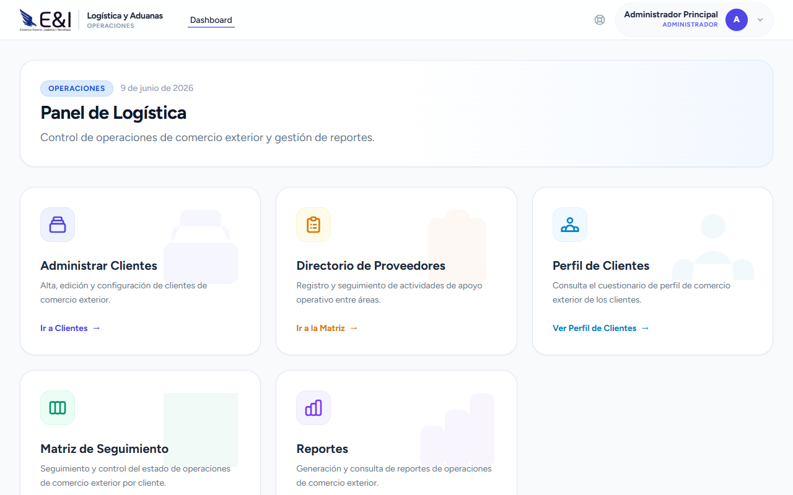

| Tarjeta | Descripción |
|---|---|
| **Administrar Clientes** | Catálogo de clientes de comercio exterior |
| **Matriz de Seguimiento** | Control de operaciones de importación/exportación |
| **Matriz de Apoyo Operativo** | Directorio de proveedores (agentes, arrastres, forwarders, navieras) |
| **Reportes** | Generación de reportes ejecutivos en Excel |

---

### 5.2 Clientes

#### 5.2.1 Ver Lista de Clientes

1. En el Dashboard Logística, haga clic en **"Administrar Clientes"**.
2. Aparece la lista de clientes registrados con:
   - Nombre del cliente
   - Ejecutivo asignado (responsable de cuenta)
   - Correos de contacto
   - Periodicidad de reporte

#### 5.2.2 Agregar un Cliente (Paso a Paso)

📋 **Prerrequisitos:** Ser usuario de Logística.

1. Haga clic en **"Nuevo Cliente"**.
2. Complete los campos:
   - **Cliente:** Nombre de la empresa.
   - **Ejecutivo asignado:** Seleccione el ejecutivo responsable de la cuenta.
   - **Correos:** Ingrese uno o más correos de contacto (separados por coma).
   - **Periodicidad de reporte:** Semanal, Quincenal, Mensual.
3. Haga clic en **"Guardar"**.

✅ **Resultado:** El cliente aparece en la lista y ya puede asociarse a operaciones en la Matriz de Seguimiento.

---

### 5.3 Matriz de Seguimiento (MFO)

#### ¿Qué es?

La Matriz de Seguimiento es el registro central de todas las operaciones de comercio exterior (importaciones y exportaciones). Cada fila representa una operación con su estatus actualizado.

#### 5.3.1 Registrar una Nueva Operación (Paso a Paso)

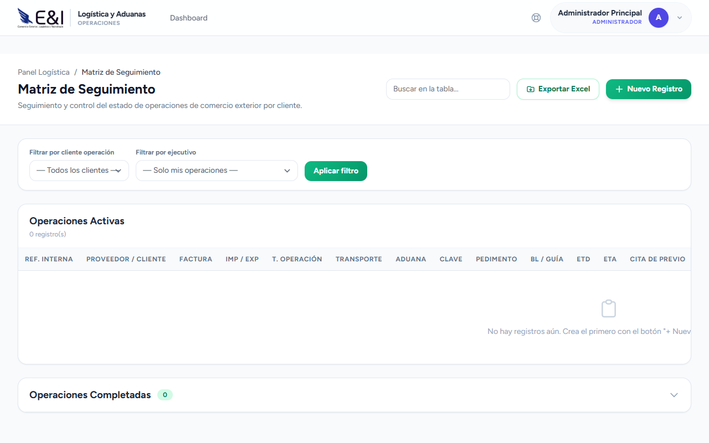

📋 **Prerrequisitos:** Tener un cliente registrado previamente.

1. En el Dashboard Logística, haga clic en **"Matriz de Seguimiento"**.
2. Haga clic en **"Nueva Operación"**.
3. Complete los campos del formulario. Se recomienda llenarlos en este orden:

**Paso 1 — Datos generales:**
- **Proveedor / Cliente:** Seleccione el cliente de la operación.
- **Referencia interna:** Número de identificación propio (opcional pero recomendado).
- **Factura:** Número de factura comercial.
- **Tipo:** Importación / Exportación.

**Paso 2 — Tipo de operación y transporte:**
- **Tipo de operación:** Marítimo / Aéreo / Terrestre / Ferroviario.
- **Transporte:** Seleccione el transportista.
- **Naviera:** (si es marítimo) Seleccione la naviera.
- **Buque / Vuelo:** Nombre de la embarcación o número de vuelo.
- **BL / Guía:** Número de conocimiento de embarque o guía aérea.

**Paso 3 — Contenedor / Carga (si aplica):**
- **Tipo de carga:** FCL (contenedor completo) / LCL (carga consolidada).
- **No. de contenedor:** Número del contenedor.
- **Tipo de contenedor:** 20' ST / 40' ST / 40' HC / 45' HC / 20' RF / 40' RF / Open Top / Flat Rack.

**Paso 4 — Fechas clave:**
- **ETD (Estimated Time of Departure):** Fecha estimada de salida.
- **ETA (Estimated Time of Arrival):** Fecha estimada de llegada.
- **Días libres:** Días de almacenaje libre en puerto.
- **Previo:** Fecha de cita de previo (revisión documental).
- **Cita de despacho:** Fecha de cita para despacho aduanal.
- **Arribo a planta:** Fecha estimada de llegada a almacén.

**Paso 5 — Aduana y pedimento:**
- **Aduana:** Seleccione la aduana de despacho.
- **Clave:** Clave de la aduana (se llena automáticamente según selección).
- **Pedimento:** Número de pedimento (si ya está disponible).

**Paso 6 — Estatus inicial:**
- **Estatus:** Seleccione el estado actual:
  | Opción | Cuándo usarlo |
  |---|---|
  | Pendiente | Operación recién creada, sin movimiento |
  | En Tránsito | Mercancía ya en camino |
  | En Aduana | En proceso de desaduanamiento |
  | Previo Programado | Cita de previo ya agendada |
  | Cita Programada | Cita de despacho agendada |
  | Despachado | Mercancía liberada por aduana |
  | Entregado | Mercancía recibida en planta |
  | Cancelado | Operación cancelada |
- **Resultado:** Seleccione el resultado esperado/real.
- **Target:** Días objetivo para completar la operación.
4. Haga clic en **"Guardar"**.

✅ **Resultado:** La operación aparece en la matriz con el estatus seleccionado.

#### 5.3.2 Actualizar el Estatus de una Operación

1. En la matriz, localice la operación que desea actualizar.
2. Haga clic en el **botón de edición** (lápiz ✏️) en la fila correspondiente.
3. Seleccione el **nuevo estatus** según el avance real de la operación.
4. Actualice **fechas** si cambiaron (ETA, previo, cita, arribo).
5. Haga clic en **"Guardar"**.

✅ **Resultado:** El estatus se actualiza. Si hay un webhook configurado, se envía una notificación a los sistemas externos.

#### 5.3.3 Agregar un Comentario de Seguimiento

📋 **Prerrequisitos:** La operación debe existir en la matriz.

1. Abra la operación haciendo clic en su **referencia o número**.
2. En la sección **"Historial de Seguimiento"**, verá los comentarios previos ordenados del más reciente al más antiguo.
3. En el campo **"Nuevo Comentario"**, escriba la novedad u observación.
   - Ejemplo: *"Se recibió documentación corregida del agente aduanal. Se procede con cita de previo."*
4. Haga clic en **"Agregar Comentario"**.

✅ **Resultado:** El comentario se registra con su nombre y la fecha/hora actual. Queda visible en el historial.

> 💡 **Buenas prácticas:**
> - Registre un comentario cada vez que haya un cambio relevante en la operación.
> - Incluya el nombre de la persona con quien habló o el documento recibido.
> - Use el historial como bitácora oficial de la operación.

---

### 5.4 Matriz de Apoyo Operativo

#### ¿Qué es?

Directorio de proveedores de servicios logísticos, organizado por tipo:

| Tipo | Incluye |
|---|---|
| 🏢 **Agentes Aduanales** | Tramitadores, gerentes de operación, clasificación de mercancías |
| 🚛 **Arrastres** | Fleteros, programación de unidades, finanzas |
| 📦 **Forwarders** | Cotización de fletes, contacto en puerto origen/destino |
| 🚢 **Navieras** | Customer service, finanzas, demoras |

#### 5.4.1 Buscar un Proveedor

1. En el Dashboard Logística, haga clic en **"Matriz de Apoyo Operativo"**.
2. Seleccione el **tipo de matriz** (Agentes, Arrastres, Forwarders o Navieras).
3. Use los filtros disponibles:
   - **Cliente** — Filtre por cliente específico.
   - **Aduana** — Filtre por aduana.
   - **Responsabilidad** — Filtre por rol (ej. "Gerente de operaciones", "Customer Service").
4. La tabla muestra: razón social, calificación, nombre del contacto, correo, teléfono.

#### 5.4.2 Agregar un Proveedor

1. Seleccione el tipo de matriz.
2. Haga clic en **"Agregar"**.
3. Complete:
   - **Cliente:** Al que aplica este proveedor.
   - **Aduana:** Aduana de operación.
   - **Razón social / Agente aduanal:** Nombre de la empresa.
   - **Calificación:** Evaluación (numérica o cualitativa).
   - **Responsabilidad:** Seleccione el rol que aplica.
   - **Nombre / Correo / Teléfono:** Datos de contacto.
   - **Comentarios:** Observaciones adicionales.
4. Haga clic en **"Guardar"**.

---

### 5.5 Reportes

#### 5.5.1 Generar un Reporte Ejecutivo (Paso a Paso)

📋 **Prerrequisitos:** Tener operaciones registradas en la Matriz de Seguimiento.

1. En el Dashboard Logística, haga clic en **"Reportes"**.
2. Configure los filtros:
   - **Periodo:** Seleccione el rango de fechas.
   - **Cliente:** Seleccione uno o varios clientes (opcional, dejar vacío = todos).
   - **Ejecutivo:** Seleccione un ejecutivo específico (opcional).
3. Haga clic en **"Generar Reporte"**.
4. El sistema procesa la información y descarga automáticamente un archivo **Excel (.xlsx)**.

**El archivo Excel contiene las siguientes hojas:**

| Hoja | Contenido |
|---|---|
| **Portada** | Título del reporte, periodo, resumen ejecutivo con KPIs principales |
| **Resumen Ejecutivo** | Tablero con indicadores: total operaciones, completadas, en proceso, demoradas, eficiencia promedio |
| **Datos** | Tabla detallada con todas las operaciones y sus campos |
| **Análisis Temporal** | Gráficos de tendencia por mes (operaciones creadas vs completadas) |
| **Desempeño por Ejecutivo** | Métricas individuales de cada ejecutivo de operaciones |

---

## 6. Módulo Legal

> **Acceso:** Usuarios con perfil Legal / Jurídico.  
> **URL:** `/legal`

### 6.1 Dashboard Legal

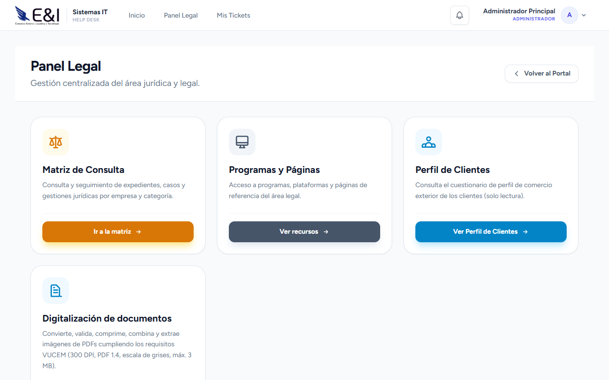

| Tarjeta | Descripción |
|---|---|
| **Matriz de Consulta** | Registro y seguimiento de consultas jurídicas |
| **Programas y Páginas** | Recursos legales de referencia |
| **Perfil de Clientes** | Cuestionario de comercio exterior (solo lectura) |
| **Digitalización** | Herramientas PDF para cumplir requisitos VUCEM |

---

### 6.2 Matriz de Consulta

#### 6.2.1 Consultar Casos

1. En el Dashboard Legal, haga clic en **"Matriz de Consulta"**.
2. Use los filtros para encontrar casos:
   - **Programa:** Seleccione un programa legal.
   - **Categoría:** Seleccione una categoría.
   - **Cliente:** Busque por cliente.
3. Cada consulta muestra: empresa, tipo, categoría, fecha, estatus.

#### 6.2.2 Registrar una Nueva Consulta (Paso a Paso)

📋 **Prerrequisitos:** Tener un programa legal y cliente registrados.

1. Haga clic en **"Nueva Consulta"**.
2. Complete el formulario:
   - **Programa:** Seleccione el programa legal relacionado.
   - **Categoría:** Seleccione la categoría legal.
   - **Cliente:** Seleccione el cliente.
   - **Consulta:** Describa detalladamente la consulta jurídica.
     - Incluya antecedentes, normativa aplicable (si se conoce), y la pregunta concreta.
3. Haga clic en **"Guardar"**.

✅ **Resultado:** La consulta queda registrada con estatus **"Pendiente"**.

#### 6.2.3 Responder una Consulta (Paso a Paso)

📋 **Prerrequisitos:** Ser abogado o consultor legal.

1. En la Matriz de Consulta, localice la consulta con estatus **"Pendiente"**.
2. Haga clic en la consulta para abrir el detalle.
3. En la sección **"Respuesta"**, escriba la resolución jurídica.
4. Haga clic en **"Responder"**.

✅ **Resultado:** La consulta cambia a estatus **"Respondida"** y queda registrada la fecha de respuesta.

---

### 6.3 Programas y Páginas

#### 6.3.1 Categorías Legales

- **Propósito:** Clasificar las áreas de práctica legal.
- **Acción:** Puede crear, editar y eliminar categorías.
- **Ejemplos:** Corporativo, Fiscal, Laboral, Comercio Exterior, etc.

#### 6.3.2 Programas

- **Propósito:** Agrupar consultas y casos bajo un mismo programa.
- **Campos:** nombre, categoría asociada, descripción, fechas de inicio/fin, estatus.
- **Crear programa:** Haga clic en **"Nuevo Programa"** → complete datos → **"Guardar"**.

#### 6.3.3 Páginas de Referencia

- URLs de interés para el área legal.
- Simplemente haga clic en el enlace para abrir la página en una nueva pestaña.

---

### 6.4 Digitalización — Herramientas PDF para VUCEM

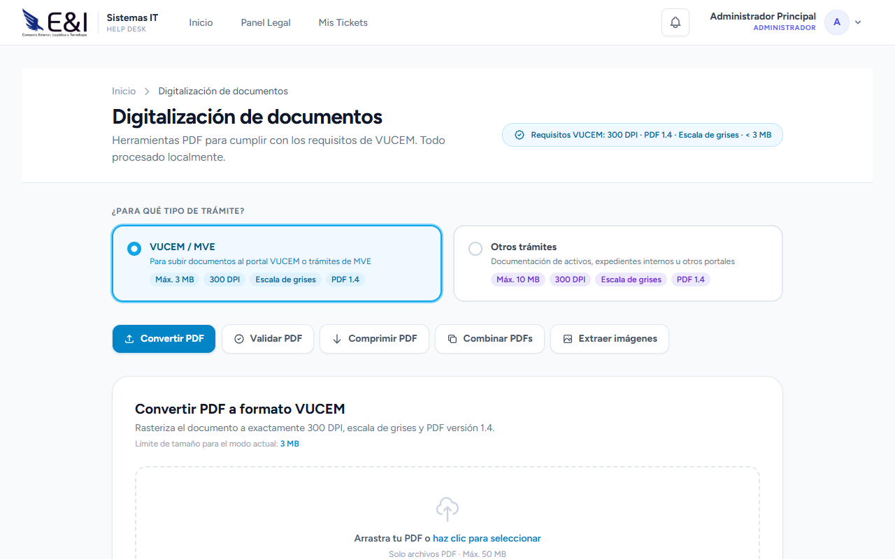

#### ¿Qué es?

Conjunto de herramientas para preparar documentos PDF que cumplan con los requisitos técnicos de VUCEM (Ventanilla Única de Comercio Exterior):
- **300 DPI** de resolución
- **Escala de grises** (no color)
- **PDF versión 1.4** o superior
- **Máximo 3 MB** (modo VUCEM) o 10 MB (otros trámites)

#### 6.4.1 Convertir un PDF a Formato VUCEM (Paso a Paso)

📋 **Prerrequisitos:** Archivo PDF de hasta 50 MB.

1. En el Dashboard Legal, haga clic en **"Digitalización"**.
2. Seleccione el **modo de trabajo**:
   - 🟦 **VUCEM/MVE** — Límite 3 MB, 300 DPI, Grayscale.
   - 🟪 **Otros trámites** — Límite 10 MB, mismos requisitos técnicos.
3. Haga clic en la pestaña **"Convertir PDF"** (icono 🔄).
4. Seleccione el archivo PDF desde su computadora.
5. Configure las opciones:
   - **Dividir en partes:** Si el PDF excede el límite de tamaño, active "Dividir" y especifique el número de partes (2-18).
   - **Orientación:** Auto / Horizontal / Vertical.
6. Haga clic en **"Convertir"**.
7. Espere mientras el sistema procesa el archivo (puede tomar varios segundos, dependiendo del tamaño).

✅ **Resultado:** El archivo convertido se descarga automáticamente. Si se dividió en partes, recibirá múltiples archivos.

**La conversión aplica:**
1. Compresión JPEG (calidad ajustable 70% → 20% si es necesario).
2. Conversión a escala de grises.
3. Reducción de resolución a 300 DPI.
4. Si el tamaño sigue siendo mayor al límite, aplica rasterización completa.

#### 6.4.2 Validar un PDF

📋 **Qué necesitas:** Archivo PDF a validar.

1. En Digitalización, haga clic en la pestaña **"Validar PDF"** (icono ✅).
2. Cargue el archivo PDF.
3. Haga clic en **"Validar"**.

**El sistema revisa:**
| Revisión | Qué valida |
|---|---|
| 📏 **Tamaño** | ¿Es menor a 3 MB (o 10 MB)? |
| 📄 **Versión PDF** | ¿Es 1.4 o superior? |
| ⚫ **Escala de grises** | ¿Tiene contenido en color? |
| 🔍 **Resolución** | ¿Es exactamente 300 DPI? |
| 🔒 **Encriptación** | ¿El PDF está protegido? |

✅ **Resultado:** Cada revisión muestra ✅ Aprobado o ❌ Rechazado, con un indicador general "Todos los checks pasaron" o "Corrija los errores marcados".

#### 6.4.3 Comprimir un PDF

1. En Digitalización, haga clic en la pestaña **"Comprimir PDF"** (icono 📦).
2. Cargue el archivo (máx. 100 MB).
3. Seleccione el **nivel de compresión**:
   - **screen** — Máxima compresión (menor calidad)
   - **ebook** — Compresión media
   - **printer** — Buena calidad
   - **prepress** — Máxima calidad (menor compresión)
4. Haga clic en **"Comprimir"**.

✅ **Resultado:** El archivo comprimido se descarga. Verá el porcentaje de reducción logrado.

#### 6.4.4 Combinar Varios PDFs

1. En Digitalización, haga clic en la pestaña **"Combinar PDFs"** (icono 🔗).
2. Agregue los archivos PDF (2 a 50 archivos).
3. Ordene los archivos arrastrándolos según la secuencia deseada.
4. Haga clic en **"Combinar"**.

✅ **Resultado:** Un solo PDF con todas las páginas de los archivos en el orden indicado.

#### 6.4.5 Extraer Imágenes de un PDF

1. En Digitalización, haga clic en la pestaña **"Extraer Imágenes"** (icono 🖼️).
2. Cargue el archivo PDF (máx. 100 MB).
3. Haga clic en **"Extraer"**.

✅ **Resultado:** Se descarga un archivo ZIP con cada página del PDF convertida a imagen JPEG (300 DPI, calidad 25%).

> 💡 Útil cuando necesita enviar cada página como imagen independiente o insertar en documentos de Word.

---

## 7. Módulo de Sistemas IT

### 7.1 Dashboard IT

> **Acceso:** Usuarios con rol administrador y área Sistemas / TI.  
> **URL:** `/admin`

| Tarjeta | Descripción |
|---|---|
| **Tickets** | Gestión de todos los tickets de soporte |
| **Usuarios** | Administración de cuentas (aprobar/rechazar) |
| **Activos IT** | Inventario de equipos tecnológicos |
| **Credenciales** | Gestión de contraseñas de equipos |
| **Mantenimiento** | Programación de slots de mantenimiento |
| **Secciones de Ayuda** | Documentación del sistema de tickets |

---

### 7.2 Tickets de Soporte

#### 7.2.1 Crear un Ticket (Paso a Paso — Para Todos los Usuarios)

📋 **Prerrequisitos:** Estar autenticado en el sistema.

1. Desde cualquier pantalla, haga clic en el **icono de herramientas** ⚙️ en la barra superior derecha.
   O vaya directamente a la URL: `/ticket`

2. **Seleccione el tipo de problema:**

   | Tipo | Cuándo usarlo |
   |---|---|
   | 🖥️ **Soporte de Software** | Problemas con programas, correo, acceso al ERP, office, licencias |
   | 🔧 **Falla de Hardware** | Monitor, teclado, mouse, impresora, red, equipo físico |
   | 🧹 **Mantenimiento Preventivo** | Limpieza, revisión periódica del equipo, aplicación de thermal paste |

3. Complete el formulario:

   **Para todos los tipos:**
   - **Nombre del solicitante** — Se llena automáticamente con su nombre.
   - **Correo electrónico** — Se llena automáticamente.
   - **Programa afectado** — Nombre del software o sistema con problema (opcional).
   - **Descripción del problema** — Explique detalladamente:
     - ¿Qué estaba haciendo cuando ocurrió el problema?
     - ¿Qué mensaje de error apareció?
     - ¿Desde cuándo ocurre?
     - ¿Afecta a 1 equipo o a varios?
   - **Archivos adjuntos:** Puede agregar capturas de pantalla o documentos que ayuden a diagnosticar (máximo 5 archivos).

   **Solo para Mantenimiento:**
   - Seleccione la **fecha deseada** para el servicio.
   - Seleccione el **horario preferido** de los slots disponibles.

4. Haga clic en **"Enviar Ticket"**.

✅ **Resultado:** Recibirá un **número de folio** con formato `TK2026MMXXXX`. Guarde este folio para dar seguimiento.

🔁 **Siguiente paso:** El administrador IT revisará su ticket y lo actualizará.

#### 7.2.2 Dar Seguimiento a Mis Tickets

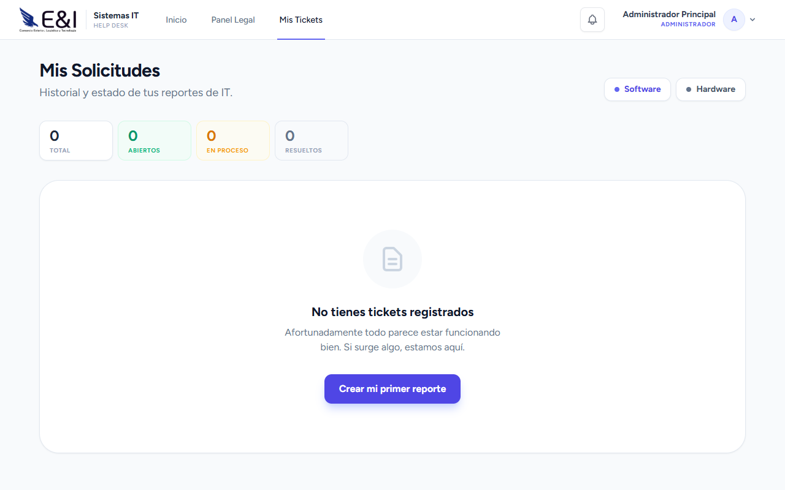

📋 **Prerrequisitos:** Tener al menos un ticket registrado.

1. Vaya a `/ticket` o haga clic en **"Mis Tickets"**.
2. Aparece un **tablero personal** con:
   - **Estadísticas:** Total de tickets, Abiertos, En Proceso, Resueltos.
   - **Botones rápidos:** "Reportar Software" y "Reportar Hardware".
   - **Tabla de tickets** con:
     - **Folio** — Identificador único.
     - **Detalle** — Resumen del problema (truncado a 50 caracteres).
     - **Archivos** — Número de archivos adjuntos.
     - **Estado** — Con etiqueta de color:
       | Estado | Color | Significado |
       |---|---|---|
       | 🟡 Abierto | Amarillo | Pendiente de atención |
       | 🔵 En Proceso | Azul | Un técnico lo está revisando |
       | 🟢 Cerrado | Verde | Problema resuelto |
     - **Prioridad:** 🔴 Crítica / 🟠 Alta / 🟡 Media / 🟢 Baja.
3. Haga clic en cualquier fila para **expandir** y ver el detalle completo.
4. Si el administrador agregó **observaciones o imágenes**, aparecerán en el detalle.

> 🔔 **Notificaciones:** Cuando su ticket sea actualizado, recibirá una notificación en la barra superior (campana) y en la lista de tickets aparecerá un indicador.

#### 7.2.3 Administrar Tickets (Solo IT Admin)

📋 **Prerrequisitos:** Acceso al panel de administración IT.

1. Vaya a `/admin/tickets`.
2. Vea **todos los tickets del sistema** con filtros por:
   - Estado (Abierto / En Proceso / Cerrado)
   - Tipo (Software / Hardware / Mantenimiento)
   - Prioridad (Baja / Media / Alta / Crítica)
   - Usuario (búsqueda por nombre o correo)
3. Haga clic en el **folio** de un ticket para abrir su detalle.
4. Desde el detalle puede:

   **Cambiar estado:**
   - **Abierto → En Proceso:** Cuando comienza a atenderlo.
   - **En Proceso → Cerrado:** Cuando el problema está resuelto.

   **Agregar información:**
   - **Observaciones internas:** Notas solo visibles para el equipo IT.
   - **Imágenes de diagnóstico:** Suba evidencia técnica.

   **Vincular a mantenimiento:**
   - Si el ticket requiere mantenimiento físico, asígnelo a un **slot de mantenimiento**.

   **Actualizar equipo:**
   - Asocie el ticket a un perfil de cómputo (ComputerProfile) si aplica.

5. Haga clic en **"Actualizar"** para guardar los cambios.

---

### 7.3 Mantenimiento de Equipos

#### 7.3.1 Reservar un Slot de Mantenimiento (Usuario)

📋 **Prerrequisitos:** Haber creado un ticket de tipo "Mantenimiento".

1. Cuando el administrador IT programe su mantenimiento, recibirá una **notificación**.
2. Vaya a su ticket y verá la fecha y hora asignada.
3. Si necesita **reprogramar**, contacte directamente al administrador IT.

#### 7.3.2 Gestionar Slots de Mantenimiento (IT Admin)

1. Vaya a `/admin/mantenimiento`.
2. En la pestaña **"Agenda de Mantenimientos"**:
   - Vea una vista semanal con los slots existentes.
   - Cada slot muestra: fecha, hora inicio-fin, capacidad, reservados.
3. Para **crear un nuevo slot**:
   - Haga clic en **"Nuevo Slot"**.
   - Complete: fecha, hora inicio, hora fin, capacidad máxima.
   - Haga clic en **"Guardar"**.
4. Para **bloquear horarios**:
   - Vaya a la pestaña **"Bloquear Horarios"**.
   - Seleccione rango de fechas y horas a bloquear.
   - Indique el motivo.
   - Haga clic en **"Bloquear"**.

---

### 7.4 Inventario de Activos IT

#### 7.4.1 Consultar Inventario (Vista General)

📋 **Prerrequisitos:** Cualquier usuario autenticado puede consultar.

1. Vaya a `/admin/activos`.
2. El inventario se muestra de dos formas alternativas:

   **Vista Individual** — Cada equipo listado por separado con:
   - Código de producto e identificador único.
   - Marca, modelo, número de serie.
   - Estado (color-coded):
     | Estado | Color | Disponibilidad |
     |---|---|---|
     | Disponible | 🟢 Verde | Puede asignarse |
     | Prestado | 🔵 Azul | Asignado a un empleado |
     | Mantenimiento | 🟡 Amarillo | En reparación |
     | Reservado | 🟠 Naranja | Apartado |
     | Dañado | 🔴 Rojo | Fuera de servicio |
   - Ubicación física.

   **Vista Agrupada** — Equipos similares agrupados por producto, mostrando totales y distribución de estados.

3. Use el **buscador** para filtrar por código, nombre, marca o serie.

#### 7.4.2 Ver Mis Equipos Asignados

1. Inicie sesión con su cuenta.
2. Vaya a `/recursos-humanos/inventario-it` (solo lectura).
3. Vea los equipos que tiene asignados actualmente con sus datos.

#### 7.4.3 Registrar un Nuevo Activo (IT Admin)

1. Haga clic en **"Agregar Artículo"** o **"Nuevo Activo"**.
2. Complete:
   - **Código de producto** (clave interna).
   - **Identificador** (código de inventario).
   - **Nombre** descriptivo.
   - **Categoría** (tipo de equipo).
   - **Marca, modelo, número de serie.**
   - **Estado inicial:** Disponible (normalmente).
   - **Ubicación:** Dónde se encuentra físicamente.
   - **Descripción y notas** (opcional).
3. Haga clic en **"Guardar"**.

#### 7.4.4 Asignar un Activo a un Empleado (IT Admin)

1. Localice el activo en el inventario.
2. Haga clic en **"Asignar"**.
3. Busque al empleado por nombre o ID.
4. Confirme la asignación.

✅ **Resultado:** El activo cambia a estado "Prestado" y queda registrado a nombre del empleado.

---

### 7.5 Credenciales de Equipos

> 🔒 **Acceso restringido** a administradores IT.

#### 7.5.1 Consultar Credenciales

1. Vaya a `/admin/credenciales`.
2. Busque por equipo, tipo o usuario asignado.
3. La tabla muestra: equipo, usuario del sistema, tipo de equipo, número de serie, SO.

#### 7.5.2 Ver una Contraseña

📋 **Prerrequisitos:** Ser administrador IT autorizado.

1. Localice la credencial deseada.
2. Haga clic en el **icono del ojo** 👁️.
3. **Confirme** que necesita ver la contraseña (modal de seguridad).
4. La contraseña se muestra en texto claro.

> ⚠️ **Seguridad:** Todas las contraseñas se almacenan encriptadas. Solo personal autorizado puede acceder a ellas y queda registro de quién las consultó.

#### 7.5.3 Agregar Nueva Credencial

1. Haga clic en **"Nueva Credencial"**.
2. Complete:
   - **Equipo asignado** (seleccione de la lista de equipos).
   - **Usuario del sistema** (nombre de usuario).
   - **Contraseña** (se encripta automáticamente al guardar).
   - **Tipo de equipo:** Laptop / Desktop / Tablet / Servidor / Otro.
   - **Sistema operativo.**
   - **Observaciones** (opcional).
3. Haga clic en **"Guardar"**.

---

### 7.6 Secciones de Ayuda

#### 7.6.1 Ver Manual de Ayuda Público

1. Vaya a `/help`.
2. Consulte el índice de secciones.
3. Haga clic en cada sección para expandir su contenido.

#### 7.6.2 Gestionar Ayuda (IT Admin)

1. Vaya a `/admin/help`.
2. Haga clic en **"Nueva Sección"** para agregar contenido.
3. Complete: título, contenido, orden, activo/inactivo.
4. Puede agregar imágenes para ilustrar los pasos.
5. Haga clic en **"Guardar"**.

---

## 8. Módulo de Administración

> **Acceso:** Usuarios con rol administrador.  
> **URL:** `/administracion`

### 8.1 Dashboard Administración

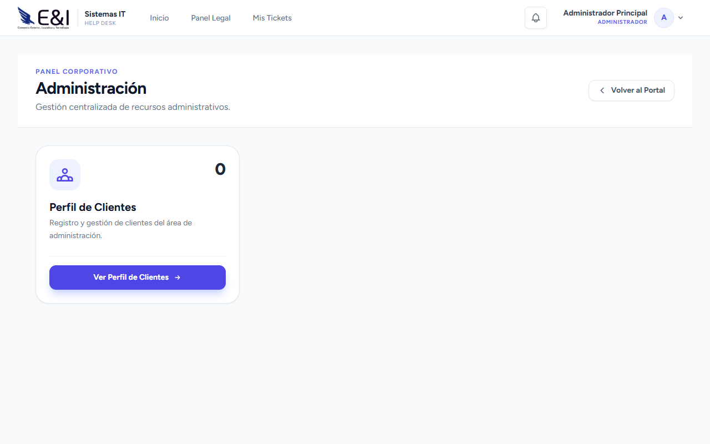

| Tarjeta | Descripción |
|---|---|
| **Clientes** | Catálogo de clientes administrativos |
| **Perfil de Clientes** | Cuestionario detallado de comercio exterior |

### 8.2 Clientes

#### 8.2.1 Ver y Editar Clientes

1. En el Dashboard Administración, haga clic en **"Clientes"**.
2. La lista muestra: nombre, contacto, correo, teléfono, empresa.

#### 8.2.2 Agregar Cliente

1. Haga clic en **"Nuevo Cliente"**.
2. Complete: nombre, contacto, correo, teléfono, empresa, notas.
3. Haga clic en **"Guardar"**.

### 8.3 Perfil de Clientes

#### ¿Qué es?

Cuestionario exhaustivo de comercio exterior que captura información detallada de cada cliente. Contiene más de 60 campos organizados en secciones.

#### 8.3.1 Llenar el Perfil de un Cliente (Paso a Paso)

📋 **Prerrequisitos:** El cliente debe estar registrado en el sistema.

1. Haga clic en **"Perfil de Clientes"**.
2. Seleccione el cliente de la lista.
3. Complete cada sección:

**Sección 1 — Datos Generales:**
- Nombre legal (razón social completa)
- RFC
- Sectores productivos
- Fecha de inicio de operaciones
- Partes relacionadas en el extranjero (Sí/No)
- Nombre del corporativo
- Ciudad/Estado/Pais del corporativo

**Sección 2 — Perfil de la Empresa:**
Para cada programa, indique si aplica (Sí/No) y la fecha:
| Programa | Campo |
|---|---|
| IMMEX | ¿Tiene IMMEX? + Fecha |
| Maquiladora | ¿Es maquiladora? + Fecha |
| PROSEC | ¿Tiene PROSEC? + Fecha |
| OEA | ¿Empresa certificada OEA? |
| IVA/EPS | ¿Certificada? + Modalidad |
| CTPAT | ¿Tiene certificación CTPAT? |
| Regla Octava | ¿Utiliza Regla Octava? |
| Almacén Fiscal | ¿Utiliza almacén fiscal? |

**Sección 3 — Sistemas de Información:**
- Sistema ERP (Manufactura)
- Sistema Anexo 24
- ¿Recibe información de agentes aduanales electrónicamente?

**Sección 4 — Antecedentes:**
- Fecha de última auditoría interna
- Fecha de última auditoría externa
- Principales hallazgos
- Observaciones y multas
- ¿Auditado por SHCP/SE? + Fecha

**Sección 5 — Volumen de Operaciones:**
- Pedimentos anuales de importación
- Pedimentos anuales de exportación
- Aduana principal de importación
- Aduana principal de exportación

**Sección 6 — Proveedores y Clientes:**
- Cantidad de proveedores extranjeros
- País de origen de importaciones
- Cantidad de clientes extranjeros
- País de destino de exportaciones
- Insumos de importación importantes
- Productos de exportación representativos

**Sección 7 — Informante:**
- Nombre de quien proporcionó la información
- Puesto del informante
- Fecha

4. Haga clic en **"Guardar Perfil"** al finalizar.

✅ **Resultado:** El perfil queda registrado y puede consultarse desde los paneles de Anexo 24, Post-Operaciones, Auditoría y Legal (solo lectura).

---

## 9. Proyectos y Actividades

> **Acceso:** Todos los usuarios autenticados.  
> **URL:** `/proyectos` y `/activities`

### 9.1 Proyectos

#### 9.1.1 Ver Lista de Proyectos

1. Vaya a `/proyectos`.
2. Vea los proyectos activos con: nombre, fechas, estatus, responsable.
3. Use los filtros para ver archivados o finalizados.

#### 9.1.2 Crear un Proyecto (Paso a Paso)

📋 **Prerrequisitos:** Cualquier usuario autenticado.

1. Haga clic en **"Nuevo Proyecto"**.
2. Complete:
   - **Nombre del proyecto** (obligatorio).
   - **Descripción** (opcional).
   - **Fecha de inicio** — Cuándo arranca.
   - **Fecha de fin** — Fecha límite estimada.
   - **Recurrencia** — ¿Cada cuánto se reúnen? (semanal, quincenal, mensual).
   - **Notas** (opcional).
3. Haga clic en **"Guardar"**.

✅ **Resultado:** El proyecto aparece en la lista. Usted queda como creador/responsable.

#### 9.1.3 Asignar Usuarios a un Proyecto

📋 **Prerrequisitos:** Ser RH o responsable del proyecto.

1. Abra el proyecto haciendo clic en su nombre.
2. En la sección **"Usuarios Asignados"**, haga clic en **"Agregar Usuario"**.
3. Busque y seleccione el usuario.
4. Confirme.

✅ **Resultado:** El usuario recibe una **notificación por correo** con los datos del proyecto. Los usuarios asignados pueden ver y gestionar las actividades del proyecto.

#### 9.1.4 Ver Reporte del Proyecto

1. Abra el proyecto.
2. Haga clic en **"Ver Reporte"** (visible si está finalizado).
3. Se muestra una vista imprimible con:
   - Datos generales del proyecto.
   - **Métricas**:
     - Total de actividades
     - Completadas a tiempo
     - Con retraso
     - Rechazadas
     - Porcentaje de eficiencia
   - Actividades detalladas.
4. Haga clic en **"Descargar PDF"** para guardar el reporte.

---

### 9.2 Actividades — Tablero de Gestión

#### 9.2.1 Ver Tablero de Actividades

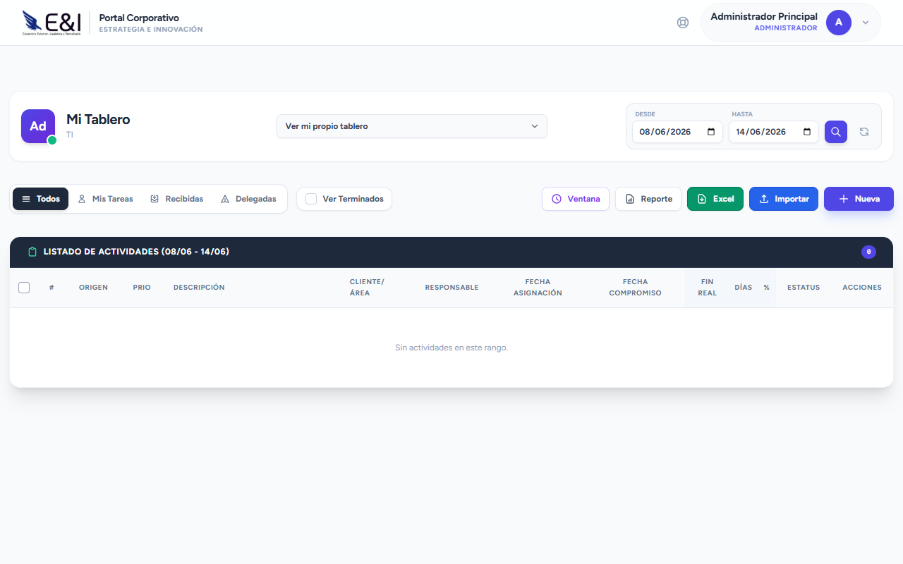

1. Vaya a `/activities`.
2. El tablero muestra todas las actividades con:
   - Tarjetas visuales con colores según el estado.
   - Posibilidad de filtrar por proyecto, cliente, prioridad, estatus.

**Estados y colores:**
| Estado | Color | Descripción |
|---|---|---|
| Pendiente | ⬜ Gris | Sin iniciar |
| En Proceso | 🔵 Azul | En desarrollo |
| Completada | 🟢 Verde | Terminada antes o en la fecha |
| Completada con Retardo | 🟠 Naranja | Terminada después de la fecha |
| Retardo | 🔴 Rojo | Vencida y no completada |
| Rechazada | 🩷 Rosa | No aceptada |

#### 9.2.2 Registrar una Nueva Actividad (Paso a Paso)

📋 **Prerrequisitos:** Tener un proyecto creado donde asociar la actividad.

1. En el tablero de actividades, haga clic en **"Nueva Actividad"**.
2. Complete el formulario:

   **Paso 1 — Información básica:**
   - **Nombre de la actividad** (obligatorio).
   - **Proyecto:** Seleccione el proyecto al que pertenece.
   - **Descripción breve** (opcional).

   **Paso 2 — Asignación:**
   - **Asignado a:** Seleccione el responsable de realizar la actividad.

   **Paso 3 — Fechas:**
   - **Fecha de inicio:** Cuándo debe comenzar.
   - **Fecha de compromiso:** Fecha límite de entrega (muy importante).
   - **Hora inicio / Hora fin programada:** Si aplica para seguimiento horario.

   **Paso 4 — Clasificación:**
   - **Área:** Departamento responsable.
   - **Cliente:** Cliente asociado (si aplica).
   - **Prioridad:** Baja / Media / Alta.
   - **Tipo de actividad:** Tipo o categoría.
3. Haga clic en **"Guardar"**.

✅ **Resultado:** La actividad aparece en el tablero con estado **"Pendiente"**.  
🔁 **Siguiente paso:** El asignado debe actualizar el estado cuando avance o complete la actividad.

#### 9.2.3 Actualizar Estado de una Actividad

📋 **Prerrequisitos:** Ser el asignado o administrador.

1. Localice la actividad en el tablero.
2. Haga clic en **"Editar"**.
3. Actualice:
   - **Estatus:** Pendiente → En Proceso (cuando empiece a trabajar).
   - **Estatus:** En Proceso → Completada (cuando termine).
   - **Comentarios** sobre el avance.
   - **Evidencia:** Suba archivos de respaldo.
4. Haga clic en **"Guardar"**.

> 💡 **Cálculo automático:**  
> El sistema calcula automáticamente:
> - **Días transcurridos** desde inicio.
> - **Resultado:** Completado (si se terminó antes del compromiso), Completado con Retardo (si se terminó después), o Retardo (si la fecha pasó y no se completó).
> - **Porcentaje** de cumplimiento.

#### 9.2.4 Importar Actividades desde Excel (Paso a Paso)

📋 **Prerrequisitos:** Tener un proyecto creado.

1. En el tablero de actividades, haga clic en **"Importar"**.
2. Descargue la **"Plantilla de Ejemplo"** para ver el formato requerido.
3. Prepare su archivo Excel/CSV con las siguientes columnas:

| Columna | Obligatorio | Descripción |
|---|---|---|
| `nombre_actividad` | ✅ Sí | Nombre de la actividad |
| `fecha_compromiso` | ❌ No | Fecha límite (YYYY-MM-DD) |
| `area` | ❌ No | Departamento |
| `cliente` | ❌ No | Cliente relacionado |
| `prioridad` | ❌ No | Baja / Media / Alta |
| `tipo_actividad` | ❌ No | Tipo o categoría |
| `hora_inicio` | ❌ No | HH:MM |
| `hora_fin` | ❌ No | HH:MM |
| `comentarios` | ❌ No | Notas adicionales |

4. Cargue el archivo y haga clic en **"Importar"**.
5. Revise el resumen de importación (actividades agregadas, errores).
6. Confirme.

✅ **Resultado:** Todas las actividades se crean en lote. Aparecen en el tablero para que los responsables las tomen.

---

## 10. Paneles de Consulta

> **Acceso:** Roles específicos (solo lectura).

### 10.1 Anexo 24
**URL:** `/anexo24`

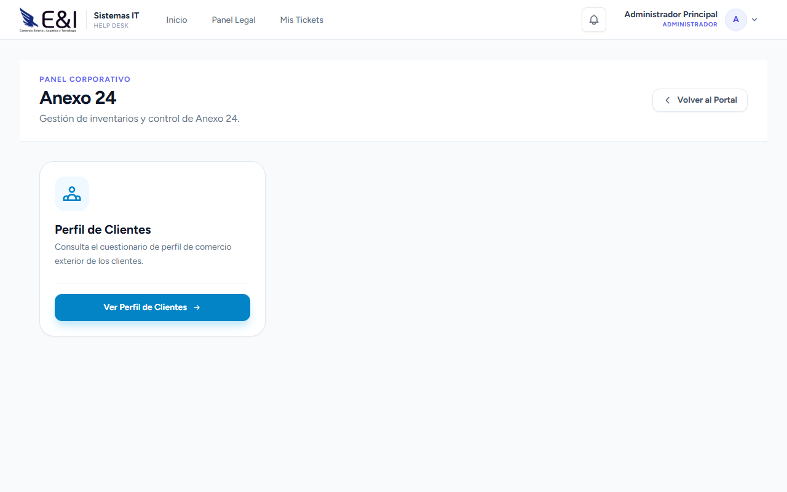

- Dashboard con información de clientes (solo lectura).
- Perfiles de comercio exterior visibles.

### 10.2 Post-Operaciones
**URL:** `/postoperaciones`

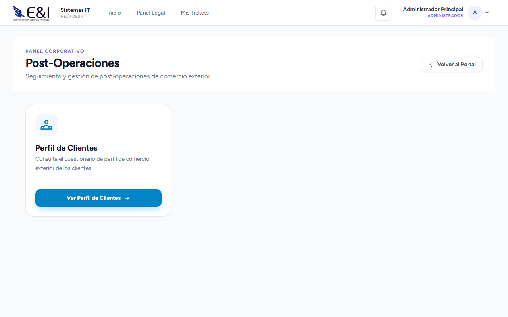

- Dashboard con clientes (solo lectura).
- Visualización de datos operativos.

### 10.3 Auditoría
**URL:** `/auditoria`

- Dashboard con clientes (solo lectura).
- Acceso a información de perfiles.

Estos paneles comparten una vista común de **"Perfil de Clientes"** que permite ver la información capturada en la sección 8.3, con un buscador en vivo y modal de visualización detallada.

---

## 11. Perfil de Usuario

### 11.1 Editar Perfil

1. Haga clic en su **nombre/avatar** en la barra superior → **"Mi Perfil"**.
2. Puede modificar:
   - **Nombre:** Cambie su nombre visible.
   - **Correo electrónico:** Requiere verificación (recibirá un correo de confirmación).
3. Haga clic en **"Guardar"**.

### 11.2 Cambiar Contraseña

1. En "Mi Perfil", vaya a la sección **"Actualizar Contraseña"**.
2. Ingrese:
   - **Contraseña actual** (para verificar identidad).
   - **Nueva contraseña**.
   - **Confirmar nueva contraseña**.
3. Haga clic en **"Guardar"**.

### 11.3 Eliminar Cuenta

1. En "Mi Perfil", vaya a la sección **"Eliminar Cuenta"**.
2. Ingrese su contraseña para confirmar.
3. Haga clic en **"Eliminar Cuenta Definitivamente"**.

> ⚠️ Esta acción no puede deshacerse.

---

## 12. Notificaciones

### 12.1 Notificaciones en el Sistema

El sistema muestra notificaciones en la barra superior para:

| Evento | Destinatario | Tipo |
|---|---|---|
| Ticket creado | Admin IT | 🔵 Campana |
| Ticket actualizado | Usuario solicitante | 🔵 Campana |
| Mantenimiento próximo | Usuario del equipo | 🔵 Campana |
| Recordatorio automático | Usuario relacionado | 🔵 Campana |

Haga clic en la campana para ver el detalle de la notificación y navegar al elemento correspondiente.

### 12.2 Notificaciones por Correo

| Correo | Cuándo se envía |
|---|---|
| **Asignación a proyecto** | Cuando le asignan un proyecto |
| **Recordatorio de junta** | El día de la junta del proyecto |
| **Recordatorio de mantenimiento** | Cuando el mantenimiento está próximo |
| **Día festivo** | Un día antes del día festivo |
| **Aviso de asistencia** | Cuando hay incidencias de asistencia |

---

## 13. Preguntas Frecuentes

### 13.1 No puedo iniciar sesión

| Causa | Solución |
|---|---|
| Cuenta pendiente de aprobación | Espere 24 hrs o contacte a su administrador |
| Contraseña incorrecta | Use "¿Olvidaste tu contraseña?" para restablecerla |
| Cuenta rechazada | Contacte a RH o Sistemas |
| Correo incorrecto | Verifique que usa su correo corporativo |

### 13.2 No veo los módulos que necesito

Su acceso depende de la **posición** registrada en su expediente de RH.

**Para verificar su posición:**
1. Haga clic en su avatar → "Mi Perfil".
2. Consulte el campo "Posición".

**Si necesita acceso adicional:**
- Contacte a RH para actualizar su posición.
- Contacte a Sistemas si cree que es un error de configuración.

### 13.3 ¿Cómo reporto un problema técnico?

1. Haga clic en el ⚙️ en la barra superior (o vaya a `/ticket`).
2. Seleccione el tipo de problema.
3. Describa detalladamente.
4. Adjunte capturas de pantalla si es posible.
5. Envíe y anote el folio de seguimiento.

### 13.4 ¿Puedo exportar datos a Excel?

Sí:

| Módulo | Qué se exporta | Cómo |
|---|---|---|
| **Logística** | Reportes ejecutivos | Sección 5.5 — "Generar Reporte" |
| **RH — Evaluaciones** | Resultados de evaluación | Sección 4.4.3 — "Exportar Excel" |
| **Actividades** | Actividades del proyecto | Sección 9.2.4 — "Importar/Exportar" |

### 13.5 ¿Cómo sé si actualizaron mi ticket?

1. Revise la **campana de notificaciones** 🔔 en la barra superior.
2. Vaya a **"Mis Tickets"** para ver el estado actual.
3. Si hay novedades, verá un indicador de "no leído".

### 13.6 Olvidé marcar asistencia

Si olvidó marcar entrada/salida:
- Contacte a RH para que registren su incidencia.
- RH puede justificarlo mediante el procedimiento de la sección 4.3.2.

### 13.7 ¿Qué navegadores puedo usar?

| Navegador | Versión mínima |
|---|---|
| Google Chrome | 100+ |
| Microsoft Edge | 100+ |
| Mozilla Firefox | 100+ |
| Safari (Mac) | 15+ |

> ❌ No se recomienda Internet Explorer.

---

## 14. Soporte y Contacto

| Canal | Información |
|---|---|
| **Correo de soporte** | `soporte@ei.com` |
| **Microsoft Teams** | Contacte al departamento de Sistemas |
| **Sistema de Tickets** | `/ticket` en el ERP (recomendado) |
| **Horario de atención** | Lunes a viernes, 9:00 AM - 6:00 PM |

Para reportar fallas, solicitar accesos o resolver dudas técnicas, abra un **ticket de soporte** desde el sistema. Es la vía más rápida y queda registro de su solicitud.

---

*Fin del Manual de Usuario — ERP Estrategia e Innovación v2.0*
